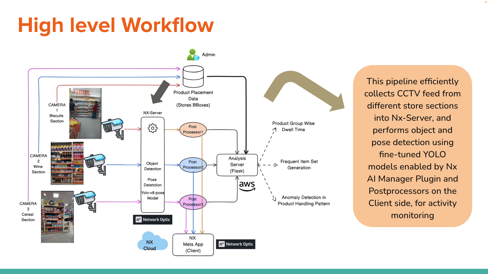
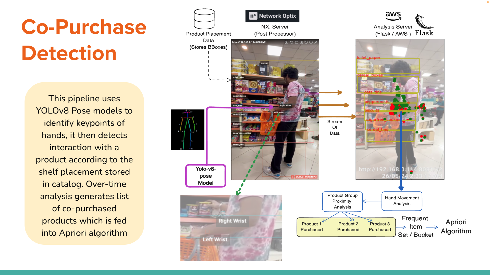
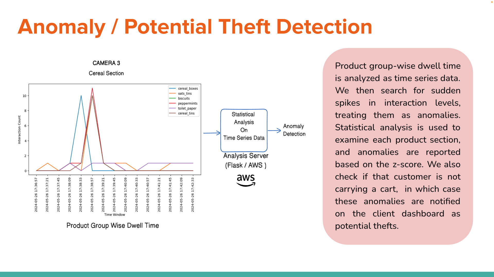
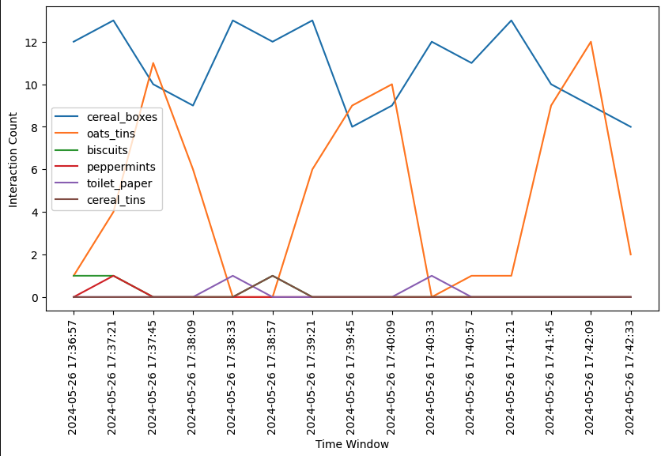

# ShopkAIper : Nx EVOS: Building Enterprise Scale Video Applications

### Team Members:

1. Anannyo Dey
2. Debasmit Roy
3. Kanko Ghosh
4. Aditya Ganguly
5. Kabir Raj Singh

### OS Requirements: 

- Linux (Ubuntu Latest Version)

### Software Requirements:

- Python 3.9 or higher

### Installation:

1. Clone the repository
2. Run the following command in the terminal:

```bash
pip install python-opencv
pip install numpy
pip install requests
```

### Install Network Optix

Follow the instructions in the link below to install Network Optix:

[Network Optix Installation](https://nx.docs.scailable.net/nx-ai-manager/1.-install-network-optix)

### Install Nx AI Manager

Follow the instructions in the link below to install Nx AI Plugin:

[Nx AI Plugin Installation](https://nx.docs.scailable.net/nx-ai-manager/2.-install-nx-ai-manager-plugin)

### Restart Nx Server

```bash
sudo chmod -R 777 /opt/networkoptix-metavms/mediaserver/bin/plugins/nxai_plugin
systemctl restart networkoptix-metavms-mediaserver.service
```

### Install NX Meta

Follow the instructions in the link below to install NX Meta:

[NX Meta Installation](https://meta.nxvms.com/download/releases/linux)

Register and login to the NX Meta application.


## Start the Camera Server

1. Run the following command in the terminal:

```bash
cd camera_server
python3 flaskk.py
```

The camera server will start running on port 8081.
Then setup the camera in the Nx Meta application.
Camera1: http://localhost:8081/v2
Camera2: http://localhost:8081/v3


## Start the Analysis Server

1. Run the following command in the terminal:

```bash
cd analysis_server
python3 flask_anal_server.py
```

The analysis server will start running on port 8888.
It is hosted on AWS as well. The link is: http://ec2-3-142-69-191.us-east-2.compute.amazonaws.com:8888
Change it accordingly in the sclbl-integration-sdk-main/postprocessor-python-cereal/postprocessor-python-cereal.py and sclbl-integration-sdk-main/postprocessor-python-fish/postprocessor-python-fish.py files.


## Build the Project with make

Run the following command in the terminal:

```bash
make
cmake .

cp postprocessor-python-cereal/postprocessor-python-cereal /opt/networkoptix-metavms/mediaserver/bin/plugins/nxai_plugin/nxai_manager/postprocessors
cp external_postprocessors.json /opt/networkoptix-metavms/mediaserver/bin/plugins/nxai_plugin/nxai_manager/postprocessors
chmod 777 /opt/networkoptix-metavms/mediaserver/bin/plugins/nxai_plugin/nxai_manager/postprocessors/postprocessor-python-cereal

cp postprocessor-python-fish/postprocessor-python-fish /opt/networkoptix-metavms/mediaserver/bin/plugins/nxai_plugin/nxai_manager/postprocessors
cp external_postprocessors.json /opt/networkoptix-metavms/mediaserver/bin/plugins/nxai_plugin/nxai_manager/postprocessors
chmod 777 /opt/networkoptix-metavms/mediaserver/bin/plugins/nxai_plugin/nxai_manager/postprocessors/postprocessor-python-fish

chmod 777 /opt/networkoptix-metavms/mediaserver/bin/plugins/nxai_plugin/nxai_manager/postprocessors/external_postprocessors.json
```

Check if the files are copied successfully:

```bash
ls -la /opt/networkoptix-metavms/mediaserver/bin/plugins/nxai_plugin/nxai_manager/postprocessors
```


## The UI is hosted on Vercel (To show the analysis results):

[ShopkAIper](https://nvexos-ui.vercel.app/)

The project is now ready to be used.


# Logic and Workflow:

## High Level Architecture:



1. Input: Real-time CCTV footage is processed as input.
2. Product Placement Data: Admins assign bounding boxes for each product group on the shelves under each camera’s field of view.
3. Pose-Detection And Object Detection: Using the YOLO-v8-pose (ONNX) model, we detect bounding boxes and body key points for each person, focusing on the 9th and 10th points (left and right wrist) for further processing.
4. Post Processing: Detection results go to the NX-Postprocessors, which apply non-max suppression and confidence thresholding, then pass the data to the NX-client for visualizing the boxes and to the Analysis server for generating insights.
5. Client Integration: The NX-Meta App receives the bounding box feed from NX-cloud and displays them.
6. Analysis Server: The Analysis server generates insights such as Frequent Item Sets, Dwell Time Analysis, and Anomaly Detection in product handling patterns.
7. Visualization: We visualize the number of interactions for each product group under each camera, along with product grouping visualizations.


## Analysis Server Workflow:



1. Input: All product placement and customer body-part bounding boxes for each frame.
2. Handing Stream of Frames: The analysis server receives frames every two seconds and keeps a 20-second buffer for synchronization.
3. Movement & Proximity Analysis: If hand-keypoints are static for a while, surrounding product bounding boxes are evaluated, and holding a product for over 8 seconds counts as an interaction.
4. Product Bucket Creation: Product buckets are created for each user based on purchased product combinations. In 30-second windows, all interactions within a product section form a "Bucket" added to the frequently purchased items dataset.
5. Apriori Algorithm: These product buckets are then fed into the Apriori algorithm, which generates association rules from sets of products to products. This helps improve product placement strategies.
6. Output: Frequent item sets for each section and interaction dwell time for each product category.


## Anomaly / Potential Theft Detection



Product group-wise dwell time is analyzed as time series data. We then search for sudden spikes in interaction levels, treating them as anomalies. Statistical analysis is used to examine each product section, and anomalies are reported based on the z-score. We also check if that customer is not carrying a cart,  in which case these anomalies are notified on the client dashboard as potential thefts.

## Dwell Time Analysis per Product Category



Dwell time is calculated for each product category by analyzing the time spent by customers in front of each product group. This helps in understanding customer preferences and product placement strategies.
